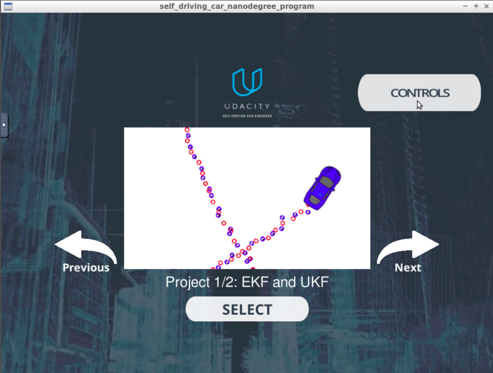
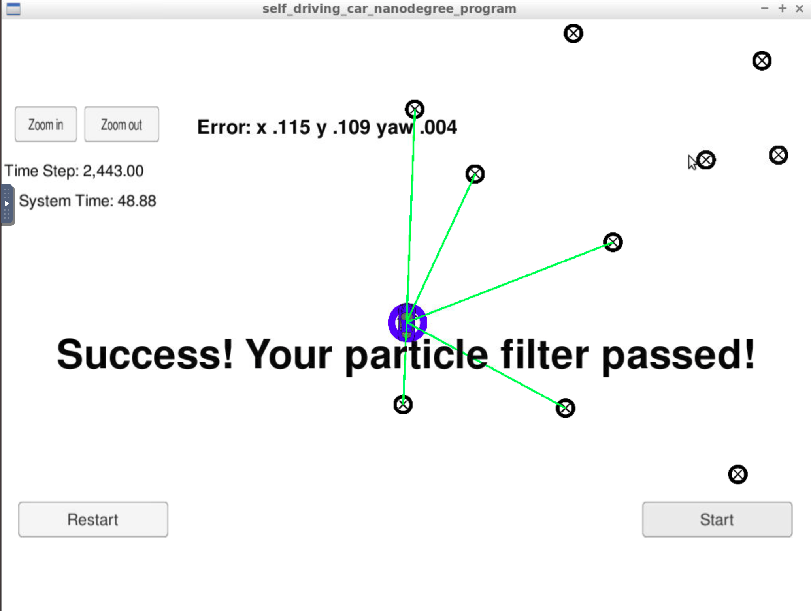

# Kidnapped Vehicle Project

#### Overview
This repository contains all the code needed to localize the position of a car placed in an unknown location. The code implements a 2 dimensional particle filter in C++. The code needs to be provided a map and some initial localization information (analogous to what a GPS would provide). At each time step the filter will also get observation and control data.
This code is meant to work with the Udacity Term 2 Simulator which provides the script for the noisy position data, vehicle controls, and noisy observations. Our code uses the uWebSockets WebSocket implementation to respond to this observation with the estimated car position.

#### Code explanation
Most of the code here has been provided by the seed repo. The only file that needs modification is the `particle_filter.cpp`. This file contains all the necessary code to create a particle filter and the various steps required for it. Some of the key methods implemented here are: `prediction`, `updateweights` and `resample`.

#### Compiling the Code
The seed repo that Udacity provides has the necessary framework for the script as well as hel;per scripts to build and run the project. In this case, the main program is built and run by executing the following in the top level directory
```
1. ./clean.sh : To clean up old files
2. ./build.sh : To build the program
3. ./run.sh : To execute the program
```
A successful run will show that it is listening on the WebSocket port

After we will need to run the Term 2 simular to verify the code.


Choose the Kidnapped Vehicle Project and hit start to run the particle filter code. A successful run of the simulator will show the following screen:


These were created in accordance to the [project rubric](https://review.udacity.com/#!/rubrics/747/view)
